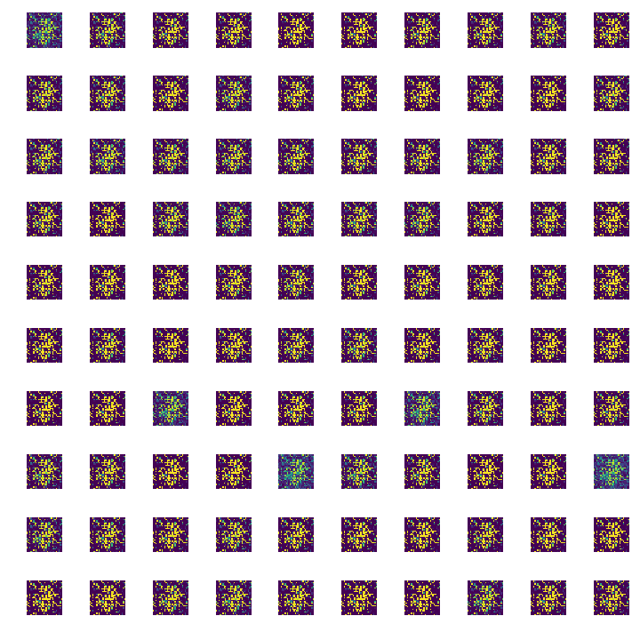

# GAN: Generative Adversarial Networks using MNIST

Simple Implementation of GAN using the Keras Library. Standard GAN using fully connected layers and training for 400 epochs. Few of the images generated are also uploaded.

